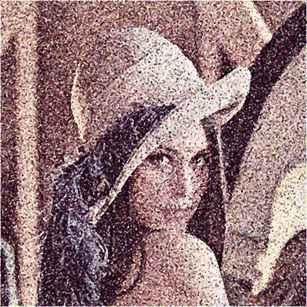
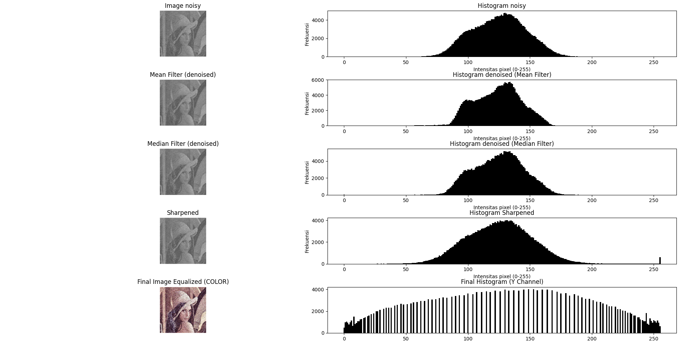

# Mini Project 1 - Image Restoration
- **Nama**: Anak Agung Ngurah Agung Kresna Ananta
- **NRP**: 5024241085

## Struktur Project
```text
mp1-image-restoration/
├── mp1.py                       # Script Python utama (Final)
├── mp1.ipynb                    # Notebook untuk eksperimen & analisis per tahap
├── README.md                    # Dokumentasi proyek
├── input/
│   └── lena_noisy.png           # Citra rusak (Input)
└── output/
    └── lena_restored.png        # Hasil restorasi akhir grayscale (Output)
    └── lena_restored_color.png  # Hasil restorasi akhir warna (Output)
```

## Penjelasan Pipeline Restorasi
Pipeline restorasi ini diimplementasikan sepenuhnya menggunakan manipulasi *array* NumPy secara manual, tanpa menggunakan fungsi *processing* bawaan dari library OpenCV. Berikut adalah urutan teknik yang diterapkan:

1. **Translasi Color Space (YCrCb):**
   Citra BGR diubah ke ruang warna YCrCb. Teknik ini dipilih untuk memisahkan Channel Y (Luminance/Intensitas Cahaya) dari Channel Cr & Cb (Chrominance/Informasi Warna). Dengan cara ini, proses pembersihan noise hanya difokuskan pada channel Y agar detail detail gambar tetap terjaga.
2. **Median Filter (Kernel 3x3):**  
   Digunakan sebagai langkah pertama untuk menghancurkan [*Salt-and-Pepper noise*](https://www.geeksforgeeks.org/electronics-engineering/difference-between-salt-noise-and-pepper-noise/) yang ekstrem. Median Filter ini sangat efektif membuang nilai piksel *outlier* (0 dan 255) tanpa merusak garis tepi secara signifikan.
3. **Mean Filter (Kernel 5x5):**  
   Citra input juga mengandung [*Gaussian noise*](https://en.wikipedia.org/wiki/Gaussian_noise) yang berupa tekstur berpasir. Karena Median Filter kurang optimal untuk jenis *noise* ini, Mean Filter 5x5 ditambahkan untuk meratakan dan melelehkan sisa-sisa *Gaussian noise* tersebut agar citra menjadi lebih halus (*smooth*).
4. **Sharpening (Laplacian Kernel 3x3):**  
   Efek samping dari penggunaan Mean Filter 5x5 adalah citra yang menjadi agak *blur*. Filter konvolusi Laplacian digunakan untuk mendeteksi perbedaan intensitas piksel tetangga dan menajamkan kembali fitur-fitur penting (seperti garis mata, topi, dan rambut Lena).
5. **Histogram Equalization:**  
   Langkah terakhir untuk mengatasi masalah *low contrast*. Dilakukan dengan menghitung [*Cumulative Distribution Function*](https://www.geeksforgeeks.org/engineering-mathematics/cumulative-distribution-function/) (CDF) dan menormalisasinya untuk meratakan distribusi piksel. Ditempatkan di akhir agar penarikan kontras tidak memperparah *noise* yang ada di awal.
6. **Rekonstruksi Warna (Merging):**
   Channel Y yang telah direstorasi digabungkan kembali dengan Channel Cr dan Cb asli. Hasil akhir kemudian dikonversi kembali ke format BGR/RGB untuk ditampilkan.

## Perbandingan Visual
| Citra Input (Noisy) | Citra Hasil Restorasi (Progress Saat Ini) |
| :---: | :---: |
|  |  |

## Langkah-langkah dan Histogram


## Analisis Singkat
- **Apa yang berhasil:** Penggabungan *Median Filter* (3x3) dan *Mean Filter* (5x5) pada channel intensitas cahaya (Y) secara efektif berhasil membersihkan *noise* ekstrem (Salt & Pepper) serta menghaluskan *Gaussian noise*. Selain itu, algoritma *Histogram Equalization* manual bekerja sempurna dalam merentangkan kontras sehingga citra yang awalnya pudar menjadi cerah dan jelas. Penggunaan *color space* YCrCb terbukti sangat berhasil merestorasi warna asli citra (melalui channel Cr dan Cb) tanpa menambah beban komputasi nested loop secara berlebihan.
- **Apa yang bisa ditingkatkan:** Terdapat dua kendala visual yang tersisa pada hasil akhir:
   1. **Artefak Stippling**: Terdapat pola menyerupai mosaik halus pada tekstur gambar. Hal ini terjadi karena penerapan *Laplacian Sharpening* mendeteksi "transisi blok" hasil smoothing dari Mean Filter 5x5 sebagai sebuah "tepi" (*edge*). Saat ditarik kontrasnya oleh *Histogram Equalization*, batas-batas blok tersebut ikut teramplifikasi secara tajam.
   2. **Chroma Noise**: Karena channel warna (Cr & Cb) sengaja dibiarkan tanpa filter (sebagai *trade-off* efisiensi komputasi), terdapat sisa bintik warna merah/biru/hijau yang terlihat jika gambar diperbesar.  

Dari hasil ini bisa disimpulkan bahwa kombinasi filter linier dasar (konvolusi spasial manual) memiliki keterbatasan dalam merestorasi citra dengan noise campuran yang berat secara sempurna tanpa sedikit mengorbankan naturalitas tekstur dan warnanya.

## Cara Menjalankan Program
1. Clone repository ini dan Masuk ke folder `mp1-image-restoration`:
    ```bash
    git clone https://github.com/Kresnananta/mini-project-pcv.git
    cd mp1-image-restoration
    ```
2. Pastikan Anda telah menginstal *library* prasyarat:
   ```bash
   pip install numpy matplotlib opencv-python
   ```
3. Pastikan file citra input `test_image_lena_noisy.png` berada pada direktori yang tepat (misalnya di folder `input/`).

4. Jalankan program:
    ```bash
    python mp1.py
    ```

5. Jupyter Notebook untuk eksperimen  
   - Buka `m1.ipynb` lalu pilih kernel python anda.
   - Jalankan Seluruh Cell dengan mengklik `Run All`.
   - Jika ingin mencoba satu per satu bisa menekan tombol Play di samping cell atau `Shift + Enter` di cell aktif.