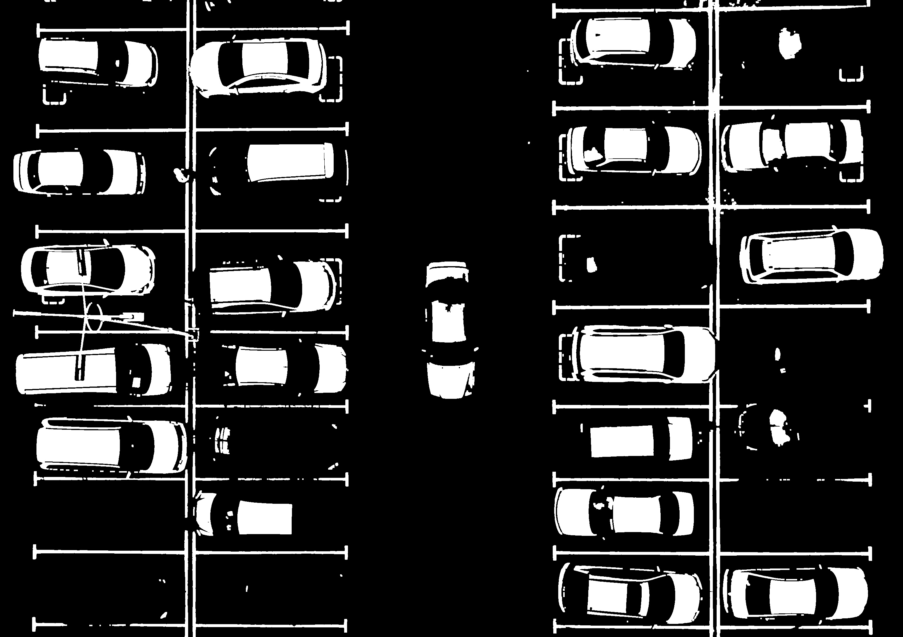
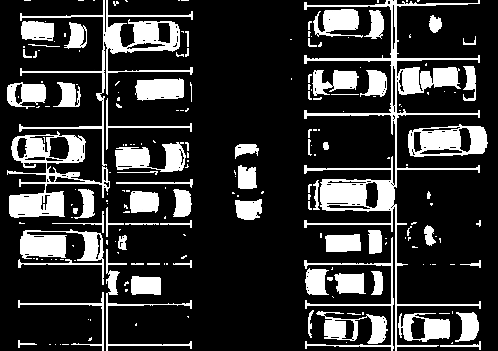
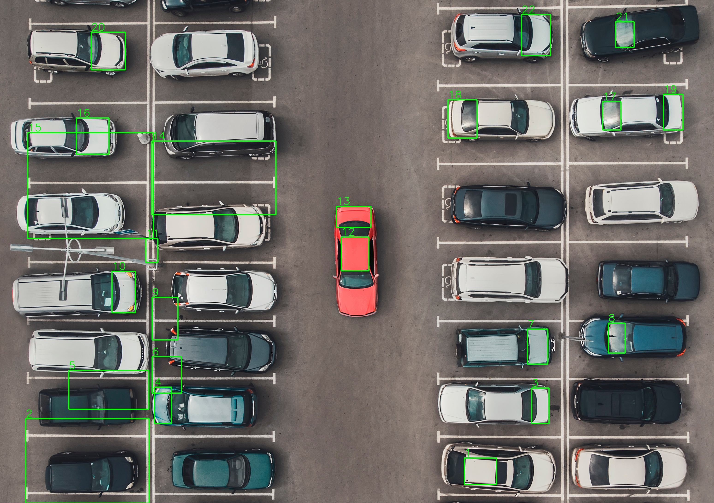

# Mini Project 2 - Object Counting
- **Nama**: Anak Agung Ngurah Agung Kresna Ananta
- **NRP**: 5024241085

## Struktur Project
```
mp2-object-counting/
├── README.md              # Dokumentasi proyek
├── counting.py            # Program Python utama
├── input/
│   └── parking.jpg        # Citra input
└── output/
    ├── result.png         # Citra output (mobil ditandai/diberi bounding box)
    └── steps/             # Visualisasi tiap tahap pipeline
```

## Penjelasan Pipeline
Pendekatan yang digunakan dalam proyek ini adalah **Threshold-based Segmentation** dipadukan dengan **Morphological Operations**. Berikut adalah tahapannya:

1. **Preprocessing (Grayscale & Gaussian Blur):**
   - Citra diubah menjadi *grayscale* untuk menyederhanakan matriks warna menjadi intensitas cahaya (0-255).
   - Diterapkan `cv2.GaussianBlur` dengan kernel (5,5) untuk menghaluskan noise berpasir pada tekstur aspal tanpa merusak garis tepi mobil yang signifikan.

2. **Otsu Thresholding:**
   - Menggunakan `cv2.threshold` dengan metode Otsu. Algoritma ini secara otomatis mencari nilai ambang batas (*threshold*) paling optimal untuk memisahkan objek terang (mobil putih/terang dan garis parkir) dari *background* gelap (aspal).

3. **Morphological Cleaning (Opening):**
   - Hasil thresholding menghasilkan banyak "sampah" berupa garis parkir putih.
   - Operasi `cv2.morphologyEx` dengan mode `MORPH_OPEN` (kernel 5x5) digunakan. Proses ini (Erosi diikuti Dilasi) secara efektif menghapus objek putih yang tipis (garis parkir) namun mempertahankan objek putih yang masif (badan mobil).

4. **Morphological Dilation (Pemadatan):**
   - Operasi `cv2.dilate` (kernel 3x3) digunakan untuk memadatkan kembali gumpalan putih badan mobil yang mungkin sedikit terkikis pada tahap *Opening*, memastikan mobil menjadi satu blok solid.

5. **Contour Extraction & Filtering:**
   - Menggunakan `cv2.findContours` (`RETR_EXTERNAL`) untuk mencari batas luar dari setiap blok putih.
   - **Filter Area (2500 - 15000 px):** Membuang sisa titik noise (area < 2500) dan *mega-blob* akibat beberapa mobil yang menyatu (area > 15000).
   - **Filter Aspect Ratio (0.4 - 2.5):** Memastikan objek yang dikotak memiliki rasio proporsional layaknya mobil (persegi panjang), membuang sisa garis panjang yang lolos.

   ## Visualisasi Tahapan
Berikut adalah visualisasi dari setiap langkah pemrosesan citra yang disimpan pada direktori `output/steps/`:

| Tahap | Gambar | Deskripsi Singkat |
| :---: | :---: | :--- |
| **1** |  | **Otsu Thresholding:** Pemisahan *foreground* terang dan *background* gelap. Garis parkir masih terlihat jelas. |
| **2** |  | **Morph Opening:** Garis parkir tipis berhasil dihapus, menyisakan badan mobil. |
| **3** |  | **Morph Dilation:** Pemadatan gumpalan putih agar badan mobil tidak berlubang/terputus. |
| **4** |  | **Final Bounding Box:** Penggambaran kotak pada kontur yang lolos seleksi luas area dan rasio. |

## Hasil Deteksi
Berdasarkan pipeline pemrosesan citra yang telah dibangun, program berhasil mendeteksi sebanyak:
**22 Mobil**

## Analisis
Selama proses pengembangan algoritma, terdapat beberapa kendala operasional yang mempengaruhi tingkat akurasi deteksi:

- **Kendala 1 (Kelemahan Otsu pada Mobil Gelap):** Algoritma Otsu Thresholding murni mengandalkan kontras terang/gelap. Mobil berwarna hitam dan abu-abu gelap memiliki nilai intensitas piksel yang sangat mirip dengan warna aspal. Akibatnya, mobil-mobil gelap tersebut dianggap sebagai *background* oleh Otsu dan berubah menjadi piksel hitam (hilang), sehingga gagal dideteksi.
- **Kendala 2 (Gumpalan Menyatu / *Fused Blobs*):** Pada beberapa area (khususnya deretan parkir sebelah kiri), jarak antar mobil sangat berdekatan dan terhubung oleh sisa piksel putih. Hal ini membuat OpenCV mendeteksinya sebagai satu objek besar yang akhirnya terbuang oleh filter luasan area maksimal.
- **Apa yang bisa ditingkatkan:** 1. Untuk mengatasi hilangnya mobil gelap, *Global Thresholding* (Otsu) dapat diganti dengan *Adaptive Thresholding* atau pendekatan *Edge-based* (Canny Edge Detection).
  2. Untuk mengatasi *Bounding Box* yang tumpang tindih akibat kontur yang terpecah, dapat diimplementasikan metode pengelompokan spasial (*Non-Maximum Suppression* / *Distance-Based Grouping*).

  ## Cara Menjalankan Program
1. Clone repository ini dan Masuk ke folder `mp1-image-restoration`:
    ```bash
    git clone https://github.com/Kresnananta/mini-project-pcv.git
    cd mp2-object-counting
    ```
2. Pastikan Anda telah menginstal *library* prasyarat:
   ```bash
   pip install numpy matplotlib opencv-python
   ```
3. Pastikan file citra input `parking_ori.jpg` berada pada direktori yang tepat (misalnya di folder `input/`).

4. Jalankan program:
    ```bash
    python mp2.py
    ```